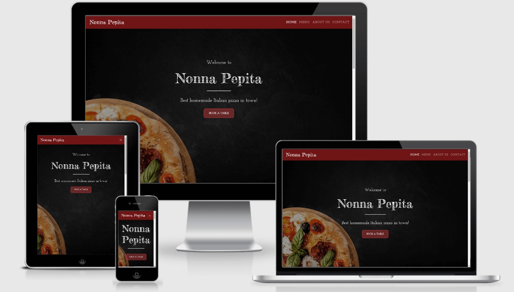

# Nonna Pepita

Nonna Pepita is a fictional Italian restaurant founded by two Italian sisters who decided to open a restaurant in Cork’s busy city center. They decided to create a fusion cuisine restaurant where they would combine fresh Irish products and imported Italian goods, using their Grandma’s old recipes.

You can visit the deployed website [here](https://fernandagil.github.io/ms1-nonnapepita-restaurant/).

---

## 1. UX

#### 1.1. Project Goals

This website was designed for the restaurant’s owner, so they can build or improve their online brand and get a wider range of customers and build loyalty. The ultimate aim of this would be to increase the sales, which we could achieve through more bookings and orders, for what we have added a call to action button to book a table in some very visible places.

This website was also designed for the public, regular and potential clients, so they can check out the menu online, find out the restaurant’s exact location or make a reservation. They would also be able to contact the restaurant for what we have added the contact details in every page of the project.

#### 1.2. User Stories

- As an owner, I want to show off what we can do to attract more clients.
- As an owner, I want to offer the possibility to book online to avoid unnecessary calls during busy hours.
- As an owner, I want my website to be easy recognisable through the icon in the tab and also through the name on the fixed navbar while the customers are navigating through the site.
- As a user, I want to be able to get in touch with the restaurant for any reason.
- As a user, I want to be able to check the opening hours and to see the restaurant's location.
- As a curious user, I want to know more about the owner's stories.
- As a person with an allergy, I want to be able to check out the menu in advance to see if this place is a good option for me.
- As a person celebrating a special occasion, I want to be able to book a table in advance so nothing goes wrong.
- As a regular customer, I want to check out the menu before my next visit so I can check out if there are any new dishes.
- As a potential client, I would like to see the the menu and compare it to other places regarding ingredients, prices, etc.

#### 1.3. Wireframes
The wireframes were designed using [Balsamiq](https://balsamiq.com/). They're accessible in the following links:

|    Desktop   |    Tablet    |    Mobile    |
|    :----:    |     :----:   |    :----:    |
|[Home Page](wireframes/desktop/home-desktop.png)|[Home Page](wireframes/tablet/home-tablet.png)|[Home Page](wireframes/mobile/home-mobile.png)|
|[Menu Page](wireframes/desktop/menu-desktop.png)|[Menu Page](wireframes/tablet/menu-tablet.png)|[Menu Page](wireframes/mobile/menu-mobile.png)|
|[About Page](wireframes/desktop/about-desktop.png)|[About Page](wireframes/tablet/about-tablet.png)|[About Page](wireframes/mobile/about-mobile.png)|
|[Contact Page](wireframes/desktop/contact-desktop.png)|[Contact Page](wireframes/tablet/contact-tablet.png)|[Contact Page](wireframes/mobile/contact-mobile.png)|

---

## 2. Features

### 2.1. Existing features

**The Header** includes:

- **Restaurant's name**: allows users to know where they are every moment.
- **Navigation Bar**: allows users to navigate the site in an easy and intuitive way.

**The Footer** includes:

- **Contact Details**: includes Phone Number and Email Address and it allows users to contact the restaurant if they have any enquiry.
- **Logo**: allows users to easily recognise the business’ identity and it separates it instantly from competition.
- **Social**: allows users to know more about the restaurant and to read other people’s reviews. These are all links to the main pages since this is a fictional restaurant.

Both the Header and the Footer are consistent throughout the website.

**Home Page** includes:

- **Call to action button**: allows users to make a reservation as soon as they enter the site
- **Discover Nonna Pepita**: allows users to know more about the restaurant's culture and includes a button leading to About us page where they can get more information if they wish.
- **Reservation form**: allows users to book a table. They’ll submit details such as day, time, number of persons or allergies they might have.
- **Location**: allows users to know the business' contact details and opening hours, it also includes an embbed Google Maps so it's easier for users to know where the restaurant is located

**Menu Page** includes:

- **Restaurant's menu**: a description of the dishes that are on the menu at the moment. It includes the prices and the ingredients so users with an allergy can see if they can eat them. 
This menu is made to be collapsible on smaller screen devices to improve the UX.

**About us Page** includes:

- **Short restaurant's story**: allows the users to get to know the restaurant's philosophy a bit better.
- **Owners's short biography**: explains the story behind the sisters and their grandmother and their experience in cooking.

**Contact Page** includes:

- **Contact form**: allows users to contact the restaurant.
- **Link to _Reservation_**: allows users that want to book a table instead to contact the restaurant to go back to the Reservation section.
- **Map**: allows users to know where the restaurant is located.

**Favicon**: allows the user to identify the site by just seeing the icon on the tab.

### 2.2. Features left to implement in the future

- The form should be  submit the forms and send a comfirmation email.
- Add a allery with some pictures of the restaurant and the dishes
- Add a section with testimonials and customers' reviews.

---

## 3. Technologies used

- [HTML5](https://en.wikipedia.org/wiki/HTML5) - provides the content and structure for my website.
- [CSS3](https://en.wikipedia.org/wiki/Cascading_Style_Sheets) - provides the styling.
- [Bootstrap](https://getbootstrap.com/) - used to create the layout of the project.
- [Balsamiq](https://balsamiq.com/) - used to create the project's wireframes.
- [Gitpod](https://gitpod.io/) - used to develop the website.
- [GitHub](https://github.com/) - used to host the project.
- [Google Fonts](https://fonts.google.com/) - used to provide the fonts Josefin Slab for the main text, and Fredericka the Great for headers.
- [Font Awesome](https://fontawesome.com/) - used the font awesome icons to style the information and the links in the footer, and also to make the Reservation section stand out a small bit.
- [Canva](https://www.canva.com/) - used to design the restaurant's logo and icon.
- [Favicon](https://www.favicon-generator.org//) - used to create the icon from the design made with Canva.
- [Pixabay](https://pixabay.com/) and [Freepik](https://www.freepik.es/) - used to get images for the project.
- [Picresize](https://picresize.com/) and [TinyJPG](https://tinyjpg.com/) - used to compress the size of the images.
- [Am I Responsive?](http://ami.responsivedesign.is/) - used to show in a quick visual way the responsiveness of the site.
- [Autoprefixer](https://autoprefixer.github.io/) - used to parsethe CSS and to add vendor prefixes to CSS rules.

## 4. Testing

The testing process can be seen [here](TESTING.md).

---

## 5. Deployment

**To deploy the project**

This project is hosted in GitHub Pages

1. On the menu on the top of the project’s repository on GitHub select **Settings**.
2. Scroll down to the GitHub **Pages** section.
3. Inside that section, click on the drop-down menu under **Source** and select **Master Branch**.
4. The page refreshes automatically and the website is now deployed.
5. The link to the webpage is just in the GitHub **Pages** section down below.

Only one branch has been used for this project.

**To run the project locally**

To clone this project from GitHub:

1. Under the repository’s name, click **Clone or download**.
2. In the **Clone with hTTPS** section, copy the given URL.
3. In your IDE of choice, open **Git Bash**.
4. Change the current working directory to the location where you want the cloned directory to be made.
5. Type **git clone**, and then paste the URL copied from GitHub.
6. Press **enter** and the local clone will be created.

---

## 6. Credits

### 6.1. Content
Most of the text in this site was made up by myself for this project. 

I got the menu from an [Italian restaurant's website](https://daks2k3a4ib2z.cloudfront.net/58ceb9bdf552f26c38942674/594210fc82bc8d319b7ef921_Piacere%20Mio%20Del%20Sur%20Dinner%202017%20authentic%20italian%20restaurant.png) and I just did a few modifications.

I also took [Bootstrap's collapsible navbar](https://getbootstrap.com/docs/4.0/components/navbar/) and modified it for this project. 

I took inspiration from [W3Schools](https://www.w3schools.com/bootstrap/bootstrap_collapse.asp) to make the restaurant's menu a dropdown for better UX on smaller devices.

### 6.2. Media

The pictures used in this site were obtained from [Pixabay](https://pixabay.com/) and [Freepik](https://www.freepik.es/).

### 6.1. Acknowledgments

[Precious Ijege](https://www.linkedin.com/in/precious-ijege-908a00168/?originalSubdomain=ng) for the mentor guidance and support.

The [Code Institute](https://codeinstitute.net/) tutor team, and specially Scott, for their help and patience.

Emmet, Lucia, Marina for their feedback, their help with the testing on their personal devices, the spelling check in both English and Italian and also for their emotional support.
