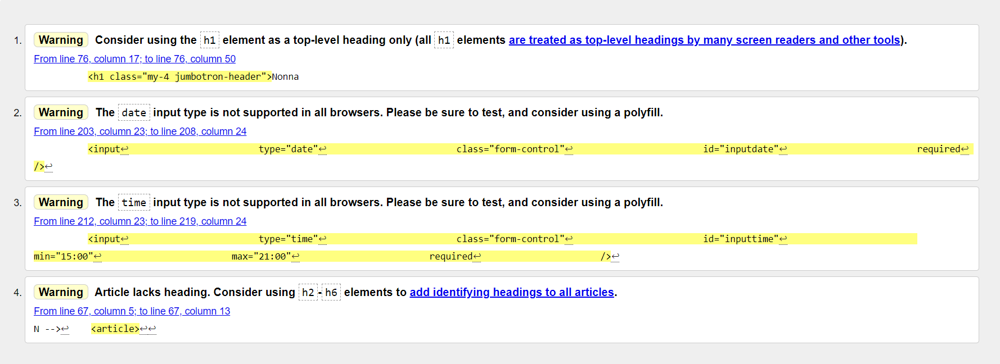
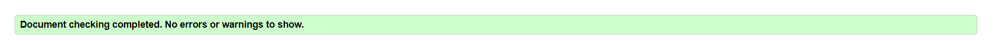
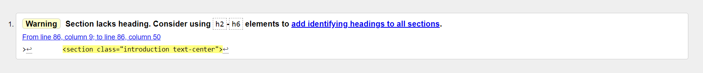
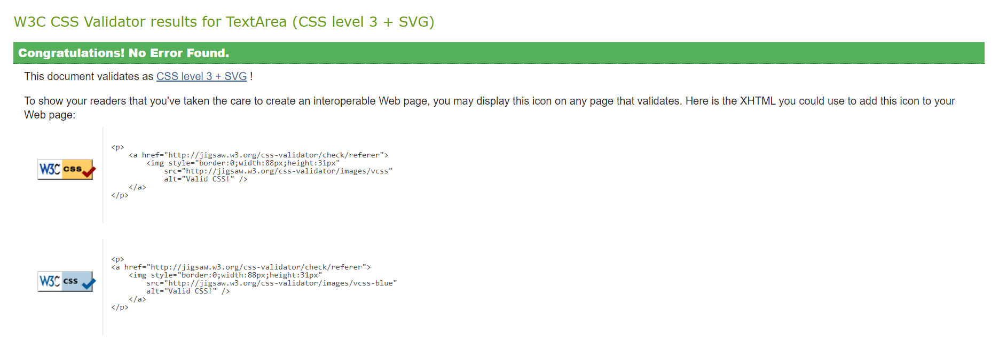
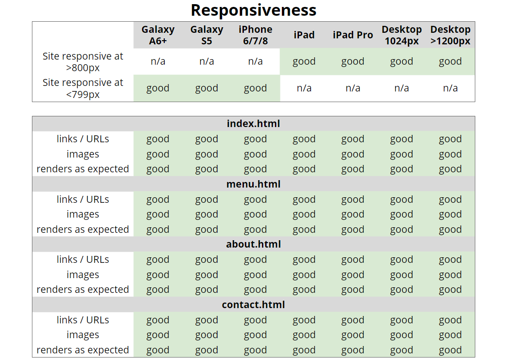
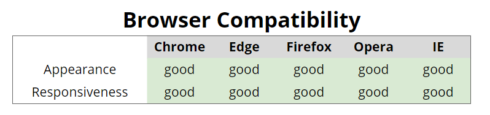

# Testing

## Code validators

[HTML Validator](https://validator.w3.org/) : 

- Home Page

The test returned an error that was solved by adding an empty value attribute. 

The warnings were ignored since they were design decisions. 

- Menu Page

- About Page

The warning was ignored following design decisions.

- Contact Page

[CSS Validator](https://jigsaw.w3.org/css-validator/) : the test didn't find any errors.

## Responsiveness

To test the responsiveness of the site I used [Chrome DevTools](https://developers.google.com/web/tools/chrome-devtools) and [Responsive Design Checker](https://www.responsivedesignchecker.com/).

Notes:

- The design is responsive in most screen sizes. The only issue that I've found is that on a 10'' Notebook screen the jumbotron on "Home Page" might overflow a small bit.

## Browser compatibility

Notes:

- The site renders quite good on Firefox, although on the **Menu Page** the headings show a white overlay/background.
- On Microsoft Edge and Internet Explorer, the call to action button on **Home Page** doesn't seem to show the background color, but thanks to the border that does display properly it's easy to still see that is a button.

## Testing User stories

- As an owner, I want to show off what we can do to attract more clients.
  - When the user is navigating the site, they'll see restaurant's images at the top of every page.
  - On the **Menu Page** the user can see all the dishes the restaurant offers with pricing information.

- As an owner, I want to offer the possibility to book online to avoid unnecessary calls during busy hours.

  and
- As a person celebrating a special occasion, I want to be able to book a table in advance so nothing goes wrong.
  - The user can find a Reservation Form when they scroll down to *Make a Reservation* in **Home Page**.
  - Alternatively, the user can find a link to go back to this form in **Contact Page**. 

- As an owner, I want my website to be easy recognisable through the icon in the tab and also through the name on the fixed navbar while the customers are navigating through the site.
  - The user can see the restaurant's name in the top left corner in every moment while navigating the page.
  - There is also a favicon that makes the website recognisable by just looking at the tab. 

- As a user, I want to be able to get in touch with the restaurant for any reason.
  - The user can access the **Contact Page** any time on the fixed menu on the top of every page, and there complete the form.
  - On tablet or mobile view, the user can click on the hamburger menu on the top right of every page.
  - Alternatively the user can find the restaurant’s contact details on the left side of the footer in every page.

- As a user, I want to be able to check the opening hours and to see the restaurant's location.
  - The user can find the restaurant's opening hours and location in the *Where to find us* section on the **Home Page**. 
  - Alternatively the user can find the restaurant’s address on the left side of the footer in every page.
  - There is also an embed Google Maps in the *Where to find us* section and in the **Contact Page** to make it easier to the user to visually recognise the restaurant’s location.

- As a curious user, I want to know more about the owner's stories.
  - The user can read a short introduction about the restaurant’s owners when scrolling down to the *Discover Nonna Pepita* section on the **Home Page**.
  - The user can then click on the *Read more* button to get to know them in more detail or, alternatively, the user can click on *About us* on the menu on the top right of every page. 
  - Both options will lead to the **About us Page** where the user can see pictures and small biography of the owners.

- As a person with an allergy, I want to be able to check out the menu in advance to see if this place is a good option for me.
  - The user can navigate to the **Menu Page** by using the top right menu. On that page the user ca see a small icon telling which of the dishes are gluten free or vegetarian. 
  - In addition, when making a reservation on **Home Page**, the user can specify if they have anyallergies and request a modification.

- As a regular customer, I want to check out the menu before my next visit so I can check out if there are any new dishes.
  
  and
- As a potential client, I would like to see the the menu and compare it to other places regarding ingredients, prices, etc.
  - The user can visit the **Menu Page** from every page just by clicking on the top right menu. 

## Bugs 

- One of the major bugs I found during the development process was the overflowing jumbotron in **Home Page** on mobile's landscape mode. 
  - This was solved by adding some media queries to make reduce some margins and paddings.

- When browsing the site on mobile, the Restaurant’s menu on **Menu Page** looked very cramped out and it was difficult to read. 
  - This was solved by making the menu in the form of a dropwdown list in the mobile mode.

- The content inside the sections *history* and *where to find us* in **Home Page** were not align vertically with respect to each other.
  - This was solved by using the align-self-center class from Bootstrap.

## Bugs to be fixed

- When using Firefox, the white overlay on headings on the **Menu Page**.

[Go back to README.md file](README.md).

