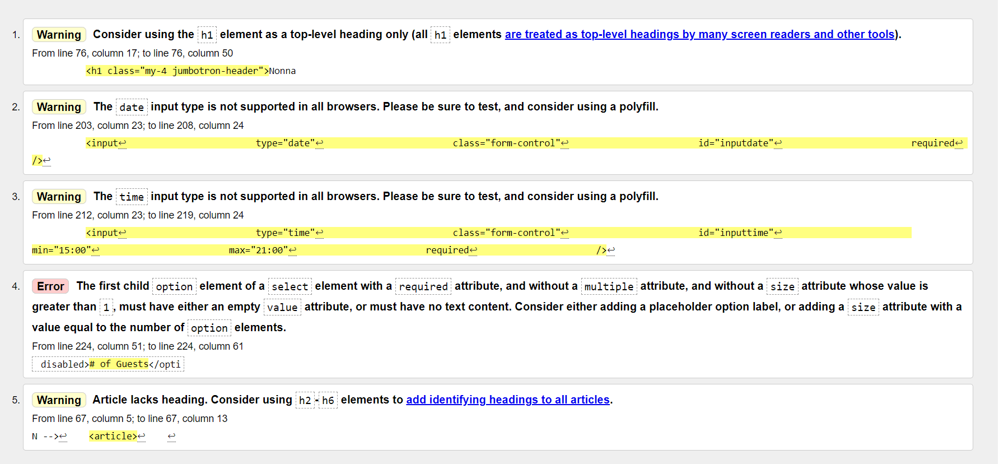

# Testing

## Code validators

[Markup Validator](https://validator.w3.org/) : the test returned an error that was solved by adding an empty value attribute. The warnings were ignored since they were design decisions. 

[CSS Validator](https://jigsaw.w3.org/css-validator/) : the test didn't find any errors.

## Responsiveness

## Browser compatibility

## User stories

## Bugs 

- One of the major bugs I found during the development process was the overflowing jumbotron on mobile's landscape mode. 
- landscape mode

